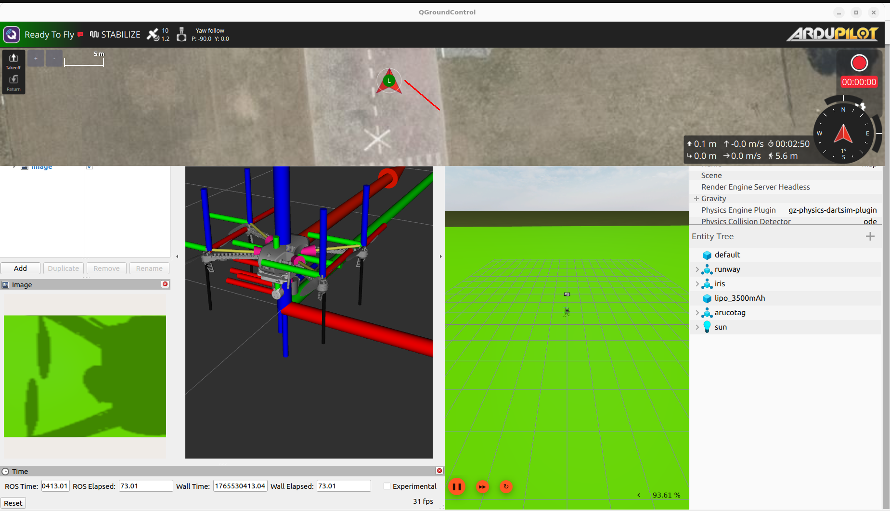

# Vision-Based Precision Landing for ArduPilot (ROS 2)

This repository implements an autonomous precision landing system for ArduPilot drones using **AprilTag**. This project achieves robust landing using only a **Monocular Camera** and **AprilTags**.

## Key Features
* **Vision-Only Navigation:** Operates without LiDAR or Sonar; relies purely on camera data and internal barometric altitude.
* **Autonomous Spiral Search:** If the target is lost, the drone triggers a velocity-based spiral search pattern at the current altitude to re-acquire the tag.
* **Locked-Yaw Descent:** A custom control strategy that locks the drone's heading (Yaw) during the final descent and uses lateral strafing (sway) to center the target. This prevents "toilet-bowling" caused by aggressive yaw corrections close to the ground.
* **Global Velocity Control:** Converts body-frame visual errors into global frame velocity commands (`cmd_vel`) for smooth, non-jerky movements.

---

## Prerequisites
* **OS:** Ubuntu 22.04
* **Middleware:** ROS 2 (Humble)
* **Flight Controller:** ArduPilot (SITL or Hardware)
* **Communication:** `mavros` ([Installation Guide](installation/MAVROS_INSTALL.md))
* **Vision:** `apriltag_ros`
* **Simulation:** Gazebo (optional, for testing)

---

## Installation

1. **Install Dependencies:**
```bash
sudo apt install ros-humble-apriltag-ros ros-humble-mavros ros-humble-mavros-msgs

```

2. **Clone Repository:**
```bash
cd ~/ros2_ws/src
git clone <your-repo-url>
colcon build
source install/setup.bash

```


---

## Setup & Usage Guide

### 1. Launch Simulation & MAVROS

Launch your simulation environment. This launch file should automatically start the Gazebo world and the MAVROS node to communicate with the flight controller.

```bash
ros2 launch <your_package_name> iris_runway.launch.py

```

### 2. Verify Vision (RViz)

Open RViz to ensure the camera is publishing data.

* **Add Topic:** `/camera/image_raw` (or `/camera/image`)
* *Check:* You should see the drone's downward view.

### 3. Prepare the Drone (QGroundControl)

1. **Gimbal:** Ensure the gimbal is pointed **Straight Down** (-90° Pitch).
2. **Takeoff:**
* Switch to **GUIDED** mode.
* Takeoff to **3 meters** (or your desired search altitude).
3. **Position:** Move the drone so the AprilTag is **visible** (for immediate landing) or **hidden** (to test the spiral search).

  


### 4. Start AprilTag Detection

Run the tag detection node. Ensure the `tags_36h11.yaml` matches your printed tag.

```bash
ros2 run apriltag_ros apriltag_node --ros-args \
    -r image_rect:=/camera/image \
    -r camera_info:=/camera/camera_info \
    --params-file ~/aprilt/src/apriltag_ros/cfg/tags_36h11.yaml

```

### 5. Start Precision Landing

Run the main control node.

```bash
ros2 run precision_landing_ardupilot precision_landing

```

---

## Technical Approach (How it Works)

The logic is handled by a robust State Machine in `final_locked_yaw_land.py`:

### 1. State: `SEARCHING` (Spiral Pattern)

* **Trigger:** Active when no AprilTag is detected.
* **Behavior:** The drone executes an expanding spiral pattern at the **current altitude**.
* **Logic:** It calculates a variable Yaw Rate and Forward Velocity to gradually increase the search radius (`INITIAL_RADIUS` + `SPIRAL_GROWTH`).

### 2. State: `CENTERING` & `ALIGN_YAW`

* **Trigger:** AprilTag detected.
* **Behavior:** The drone halts the spiral and uses Proportional (P) control to align the camera center with the tag center.
* **Logic:** It briefly aligns the Yaw to face the target before locking the heading.

### 3. State: `CHASE_AND_LAND` (Locked-Yaw)

* **Trigger:** Target is centered within tolerance.
* **Behavior:**
* **Yaw Lock:** The drone's heading is explicitly forced to `0.0` (or fixed) to prevent rotation errors.
* **Strafing:** X and Y visual errors are converted into **Lateral (Side)** and **Forward** velocities.
* **Coordinate Transform:** These body-frame velocities are rotated by the current Yaw angle to generate valid `mavros/setpoint_velocity/cmd_vel_unstamped` global commands.
* **Descent:** When the error is below 40 pixels, the drone descends (`-0.3 m/s`).


### 4. Final Landing

* **Trigger:** Altitude < `LAND_ALT` (0.2m).
* **Behavior:** The node sends a `LAND` mode service call to ArduPilot to cut motors and disarm.

---

## Configuration

You can customize the landing behavior by editing the `__init__` section of the python script:

* `self.SEARCH_SPEED`: Speed of the spiral search.
* `self.LAND_ALT`: Altitude at which the final land mode is triggered.
* `self.KP_STRAFE`: Aggressiveness of the horizontal corrections.

```

```
