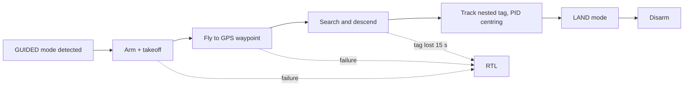

# Vision-Based Precision Landing for ArduPilot (ROS 2)

Autonomous takeoff, GPS waypoint flight and AprilTag-guided precision landing for ArduCopter, built on ROS 2 Humble and MAVROS. It runs on a Raspberry Pi 5 with an IMX500 camera and a Cube Orange+ flight controller.

> **Read [SAFETY.md](SAFETY.md) before you power the drone.** With this stack running, switching the flight controller to GUIDED mode **arms the vehicle and takes off automatically**.

Developed by Abhin M for ICFOSS. Released under the MIT license.

<p align="center">
  
  <br>
  <em>Autonomous precision landing touchdown: Fury quadcopter centered and landed directly on the nested AprilTag target.</em>
</p>

<p align="center">
  
  <br>
  <em>Autonomous AprilTag detection, descent, and precision touchdown recorded in field flight testing.</em>
</p>

## What it does

1. You switch the Cube to **GUIDED** with the RC transmitter.
2. The mission executive arms, takes off to the configured altitude (default 6 m) and flies to a GPS waypoint.
3. At the waypoint, the landing server searches for a **nested AprilTag** (three tags of different sizes in one target), descends while centring on it with a PID loop, and switches to LAND mode near the ground.
4. If anything goes wrong (lost MAVROS heartbeat, rejected goal, tag lost for 15 s) it switches to **RTL**.


```mermaid
flowchart LR
    A[GUIDED mode detected] --> B[Arm + takeoff]
    B --> C[Fly to GPS waypoint]
    C --> D[Search and descend]
    D --> E[Track nested tag, PID centring]
    E --> F[LAND mode]
    F --> G[Disarm]
    B -. failure .-> R[RTL]
    C -. failure .-> R
    D -. tag lost 15 s .-> R
```

## Results

| Camera mode | Max AprilTag detection altitude | Tag |
| --- | --- | --- |
| IMX500, 640x480 | 7-8 m | 22.7 cm outer tag, family 48h12 |
| IMX500, 1280x720 | 10-12 m | 22.7 cm outer tag, family 48h12 |

Landing accuracy (distance from tag centre at touchdown): TODO: add measured values.

### Landing photos

| Side view | Top view | Setup, landed on the tag |
| --- | --- | --- |
|  |  |  |

How these numbers relate to tag size and resolution: [docs/detection-range.md](docs/detection-range.md).

## System overview

```text
IMX500 camera --> camera node --> apriltag_ros --> /detections
                                                       |
RC (mode switch) --> Cube Orange+ <--USB--> MAVROS     v
                         ^                     landing_server  --> /mavros/setpoint_velocity/cmd_vel_unstamped
                         |                     navigation_server --> /mavros/setpoint_raw/global
                         |                     mission_executive (arm, takeoff, sequencing, failsafe)
                         +---- everything runs in Docker on a Raspberry Pi 5
```

## Hardware

| Part | Used in this project |
| --- | --- |
| Flight controller | Cube Orange+ running ArduCopter |
| Companion computer | Raspberry Pi 5 (Docker, ROS 2 Humble in an Ubuntu 22.04 container) |
| Camera | IMX500, mounted facing straight down |
| Camera mount | 3D-printed PLA holder, designed in Onshape ([files](docs/hardware/camera-holder/README.md)) |
| Link | USB cable from the Cube to a Pi 5 USB port (MAVROS) |

| Camera from below | Whole vehicle from below |
| --- | --- |
|  |  |

Details, wiring and the power warning: [docs/hardware/README.md](docs/hardware/README.md).

## Quick start

1. Read [SAFETY.md](SAFETY.md).
2. Build the hardware: [docs/hardware/README.md](docs/hardware/README.md) and the [camera holder](docs/hardware/camera-holder/README.md).
3. Set up the Raspberry Pi 5 with the Docker image (separate repository): TODO: add Docker repo link.
4. Print your tag: [docs/tags.md](docs/tags.md).
5. Edit [src/autonomous_flight_stack/config/params.yaml](src/autonomous_flight_stack/config/params.yaml): target GPS position, altitude, tag IDs.
6. Test in simulation first: [docs/simulation.md](docs/simulation.md).
7. Run on hardware with propellers off, then tethered, then free flight: [docs/software/README.md](docs/software/README.md).

## Documentation Roadmap

Read the documentation sequentially following this guided workflow:

| Step | Document | Contents |
| :---: | :--- | :--- |
| **01** | [SAFETY.md](SAFETY.md) | **Safety First**: Pre-arm checklists and kill switch configuration |
| **02** | [docs/hardware/README.md](docs/hardware/README.md) | **Hardware Setup**: Parts list, BEC power regulation, CSI wiring, bench test |
| **03** | [docs/hardware/camera-holder/README.md](docs/hardware/camera-holder/README.md) | **Camera Mount**: 3D printed CAD models, print settings, assembly guide |
| **04** | [docs/tags.md](docs/tags.md) | **Target Design**: Concentric 48h12 nested AprilTag markers & sizing |
| **05** | [docs/detection-range.md](docs/detection-range.md) | **Detection Range**: Optical geometry and maximum altitude equations |
| **06** | [docs/simulation.md](docs/simulation.md) | **SITL Simulation**: Gazebo world, RViz visualization, and mission replay |
| **07** | [docs/software/README.md](docs/software/README.md) | **Software Stack**: Raspberry Pi OS, Docker container, and topic checks |
| **08** | [docs/software/nodes.md](docs/software/nodes.md) | **ROS 2 Nodes**: Mission executive, navigation, and landing action servers |
| **09** | [docs/software/config.md](docs/software/config.md) | **Configuration**: Parameter tuning reference for `params.yaml` |
| **10** | [docs/landing-algorithm.md](docs/landing-algorithm.md) | **Landing Logic**: State machine, PID descent loops, and touchdown checks |
| **11** | [docs/troubleshooting.md](docs/troubleshooting.md) | **Troubleshooting**: Diagnostic matrix for common flight issues |
| **12** | [docs/known-issues.md](docs/known-issues.md) | **Known Issues**: Active firmware considerations and limitation log |

## Repository layout

```text
Precision_landing_ardupilot/
  README.md
  SAFETY.md
  LICENSE
  src/autonomous_flight_stack/config/params.yaml            all tunable parameters
  src/autonomous_flight_stack/launch/uav_core.launch.py     starts the three nodes with the parameter file
  src/
    autonomous_flight_stack/scripts/   mission_executive.py, navigation_server.py, landing_server.py
    uav_interfaces/action/             NavigateToWaypoint.action, PrecisionLand.action
  docs/
    images/overview/                   photos used in this README
    hardware/images/                   photos used in docs/hardware/README.md
    hardware/camera-holder/images/     photos used in the camera holder README
```

## License

MIT, see [LICENSE](LICENSE).


---

<div align="center">

| 📖 Documentation Guide | ➡️ [**Start Step 01: Safety Guide (SAFETY.md)**](SAFETY.md) |
| :---: | :---: |

</div>
